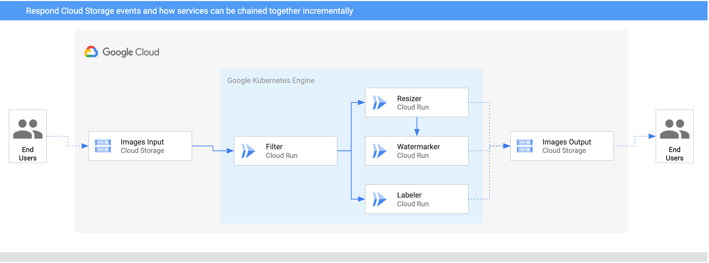

# Image Processing Pipeline - GKE

In this sample, we'll build an image processing pipeline to connect Google Cloud
Storage events to various services with Events with Cloud Run on GKE.



1. An image is saved to an input Cloud Storage bucket.
2. Cloud Storage update event is read into Knative by `CloudStorageSource`.
3. Filter service receives the Cloud Storage event. It uses Vision API to
   determine if the image is safe. If so, it creates a custom `CloudEvent` of
   type `dev.knative.samples.fileuploaded` and passes it onwards.
4. Resizer service receives the `fileuploaded` event, resizes the image using
   [ImageSharp](https://github.com/SixLabors/ImageSharp) library, saves to the
   resized image to the output bucket, creates a custom `CloudEvent` of type
   `dev.knative.samples.fileresized` and passes the event onwards.
5. Watermark service receives the `fileresized` event, adds a watermark to the
   image using [ImageSharp](https://github.com/SixLabors/ImageSharp) library and
   saves the image to the output bucket.
6. Labeler receives the `fileuploaded` event, extracts labels of the image with
   Vision API and saves the labels to the output bucket.

## Prerequisites

Events for Cloud Run is currently private alpha. We're assuming that you already
have your project white listed
[here](https://sites.google.com/corp/view/eventsforcloudrun), read the [Complete
User
Guide](https://docs.google.com/document/d/16UHFfDQJlpFb1WsrPZ-DYEP8_HcLbbRPK1ScACXct6U/edit)
for Events for Cloud Run - GKE and setup a GKE cluster with Cloud Run Events
installed as described in the guide.

If everything is setup correctly, you should see pods running in
`cloud-run-events` and `knative-eventing` namespaces and a `Broker` in the
default namespace:

```bash
kubectl get pods -n cloud-run-events
kubectl get pods -n knative-eventing
kubectl get broker
```

You should also set some variables to hold your cluster name and zone. For
example:

```bash
export CLUSTER_NAME=events-cluster
export CLUSTER_ZONE=europe-west1-b

gcloud config set run/cluster $CLUSTER_NAME
gcloud config set run/cluster_location $CLUSTER_ZONE
gcloud config set run/platform gke
```

## Create storage buckets

Create 2 unique storage buckets to save pre and post processed images:

```bash
export BUCKET1="$(gcloud config get-value core/project)-images-input"
export BUCKET2="$(gcloud config get-value core/project)-images-output"
gsutil mb gs://$BUCKET1
gsutil mb gs://$BUCKET2
```

## Enable Vision API

Some services use Vision API. Make sure the Vision API is enabled:

```bash
gcloud services enable vision.googleapis.com
```

## Filter

This service receives Cloud Storage events for saved images. It uses Vision API
to determine if the image is safe. If so, it passes a custom event onwards.

### Service

The code of the service is in
[filter](https://github.com/meteatamel/knative-tutorial/tree/master/eventing/image-processing-pipeline/filter)
folder.

Inside the folder where [Dockerfile](https://github.com/meteatamel/knative-tutorial/blob/master/eventing/image-processing-pipeline/filter/csharp/Dockerfile) resides, build and save the container
image:

```bash
export SERVICE_NAME=filter
gcloud builds submit --tag gcr.io/$(gcloud config get-value project)/${SERVICE_NAME}:v1
```

Deploy the service:

```bash
gcloud run deploy ${SERVICE_NAME} \
  --image gcr.io/$(gcloud config get-value project)/${SERVICE_NAME}:v1
```

### Trigger

The trigger of the service filters on Cloud Storage finalize events:
`com.google.cloud.storage.object.finalize`.

Create the trigger:

```bash
gcloud alpha events triggers create trigger-${SERVICE_NAME} \
--target-service ${SERVICE_NAME} \
--type=com.google.cloud.storage.object.finalize \
--parameters bucket=$BUCKET1
```

## Resizer

This service receives the custom event, resizes the image using
[ImageSharp](https://github.com/SixLabors/ImageSharp) library and passes the
event onwards.

### Service

The code of the service is in [resizer](https://github.com/meteatamel/knative-tutorial/tree/master/eventing/image-processing-pipeline/resizer)
folder.

Inside the folder where [Dockerfile](https://github.com/meteatamel/knative-tutorial/tree/master/eventing/image-processing-pipeline/resizer/csharp/Dockerfile) resides, build and save the container
image:

```bash
export SERVICE_NAME=resizer
gcloud builds submit --tag gcr.io/$(gcloud config get-value project)/${SERVICE_NAME}:v1
```

Deploy the service:

```bash
gcloud run deploy ${SERVICE_NAME} \
  --image gcr.io/$(gcloud config get-value project)/${SERVICE_NAME}:v1 \
  --update-env-vars BUCKET=${BUCKET2}
```

### Trigger

The trigger of the service filters on `dev.knative.samples.fileuploaded` event
types which is the custom event type emitted by the filter service.

Create the trigger:

```bash
gcloud alpha events triggers create trigger-${SERVICE_NAME} \
--target-service $SERVICE_NAME \
--type=dev.knative.samples.fileuploaded \
--custom-type
```

## Watermark

This service receives the event, adds the watermark to the image using
[ImageSharp](https://github.com/SixLabors/ImageSharp) library and saves the
image to the output bucket.

### Service

The code of the service is in [watermarker](https://github.com/meteatamel/knative-tutorial/tree/master/eventing/image-processing-pipeline/watermarker)
folder.

Inside the folder where [Dockerfile](https://github.com/meteatamel/knative-tutorial/tree/master/eventing/image-processing-pipeline/watermarker/csharp/Dockerfile) resides, build and save the container
image:

```bash
export SERVICE_NAME=watermarker
gcloud builds submit --tag gcr.io/$(gcloud config get-value project)/${SERVICE_NAME}:v1
```

Deploy the service:

```bash
gcloud run deploy ${SERVICE_NAME} \
  --image gcr.io/$(gcloud config get-value project)/${SERVICE_NAME}:v1 \
  --update-env-vars BUCKET=${BUCKET2}
```

### Trigger

The trigger of the service filters on `dev.knative.samples.fileresized` event
types which is the custom event type emitted by the resizer service.

Create the trigger:

```bash
gcloud alpha events triggers create trigger-${SERVICE_NAME} \
--target-service $SERVICE_NAME \
--type=dev.knative.samples.fileresized \
--custom-type
```

## Labeler

Labeler receives the event, extracts labels of the image with Vision API and
saves the labels to the output bucket.

### Service

The code of the service is in [labeler](https://github.com/meteatamel/knative-tutorial/tree/master/eventing/image-processing-pipeline/labeler)
folder.

Inside the folder where [Dockerfile](https://github.com/meteatamel/knative-tutorial/tree/master/eventing/image-processing-pipeline/labeler/csharp/Dockerfile) resides, build and save the container
image:

```bash
export SERVICE_NAME=labeler
gcloud builds submit --tag gcr.io/$(gcloud config get-value project)/${SERVICE_NAME}:v1
```

Deploy the service:

```bash
gcloud run deploy ${SERVICE_NAME} \
  --image gcr.io/$(gcloud config get-value project)/${SERVICE_NAME}:v1 \
  --update-env-vars BUCKET=${BUCKET2}
```

### Trigger

The trigger of the service filters on `dev.knative.samples.fileuploaded` event
types which is the custom event type emitted by the filter service.

Create the trigger:

```bash
gcloud alpha events triggers create trigger-${SERVICE_NAME} \
--target-service $SERVICE_NAME \
--type=dev.knative.samples.fileuploaded \
--custom-type
```

## Test the pipeline

Before testing the pipeline, make sure all the triggers are ready:

```bash
gcloud alpha events triggers list

   TRIGGER              EVENT TYPE                                TARGET
✔  trigger-filter       com.google.cloud.storage.object.finalize  filter
✔  trigger-labeler      dev.knative.samples.fileuploaded          labeler
✔  trigger-resizer      dev.knative.samples.fileuploaded          resizer
✔  trigger-watermarker  dev.knative.samples.fileresized           watermarker
```

You can upload an image to the input storage bucket:

```bash
gsutil cp beach.jpg gs://$BUCKET1
```

After a minute or so, you should see resized, watermarked and labelled image in
the output bucket:

```bash
gsutil ls gs://$BUCKET2

gs://events-atamel-images-output/beach-400x400-watermark.jpeg
gs://events-atamel-images-output/beach-400x400.png
gs://events-atamel-images-output/beach-labels.txt
```
