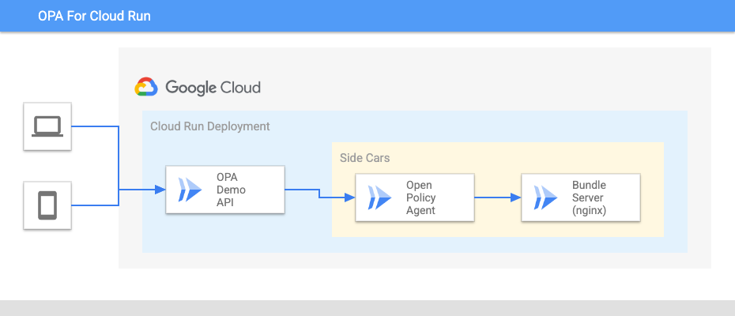

# Running OPA as a side car in Cloud Run

In this tutorial, we will use the [same example](http://openpolicyagent.org/docs/latest/http-api-authorization/) that is documented in the official OPA website, but substitute using [Cloud Run side cars](https://cloud.google.com/run/docs/deploying#sidecars) instead of Docker Compose.

We'll end up with a deployment like this:



The goal is to use a simple HTTP web server that accepts any HTTP GET request that you issue and echoes the OPA decision back as text. OPA will fetch policy bundles from a simple bundle server. OPA, the bundle server, and the web server will be run as containers in Cloud Run. In a production environment, you likely will have a different bundle server, but it's convenient to package it together here.

# Prerequsites

* An up to date gcloud SDK installed
* [opa](https://www.openpolicyagent.org/docs/latest/) installed
* A text editor
* a Google Cloud project with the Cloud Run API enabled

# 1. Create and push a custom bundle server image

* Follow [Step 1](https://www.openpolicyagent.org/docs/latest/http-api-authorization/#1-create-a-policy-bundle) in the original tutorial, resulting in creating two files called `example.rego` and `bundle.tar.gz`.
* Create a custom bundle server with [Dockerfile.nginx](./Dockerfile.nginx) and [nginx.conf.template](./nginx.conf.template) with the following command:

```bash
docker build -f Dockerfile.nginx -t us-central1-docker.pkg.dev/<CLOUD_PROJECT>/docker/<IMAGE_NAME> .  

docker push us-central1-docker.pkg.dev/<CLOUD_PROJECT>/docker/<IMAGE_NAME>
```

Note: We assume Google Cloud Artifact Registry in this tutorial but any registry accessible to Cloud Run will work

# 2. Update opa-service.yml

Read through [Step 2](https://www.openpolicyagent.org/docs/latest/http-api-authorization/#2-bootstrap-the-tutorial-environment-using-docker-compose) in the original tutorial, but instead of creating a `docker-compose.yml` file and using `docker-compose` to create the service, we're instead going to use `opa-service.yaml` to deploy three containers to a single cloud run deployment.

* Update the bundle server image path ([line 39](./opa-service.yml#39)) to the path of your custom image above.
* use gcloud to deploy:

```bash
gcloud beta run services replace opa-service.yaml
```

# 3. Verify

Follow [steps 3-5](https://www.openpolicyagent.org/docs/latest/http-api-authorization/#3-check-that-alice-can-see-her-own-salary) in the original tutorial to verify the policies with one small change:
  
  any time you see `localhost:5000` replace it with the Cloud Run URL. For e.g.

```bash
curl --user alice:password <CLOUD_RUN_URL>/finance/salary/alice
```
